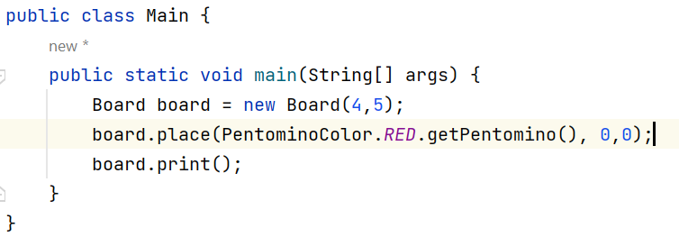
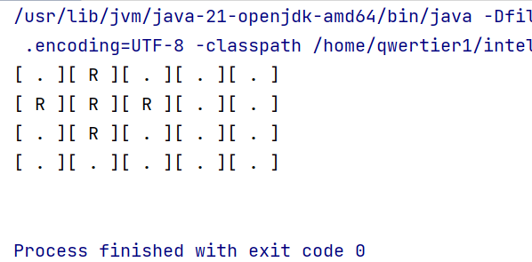
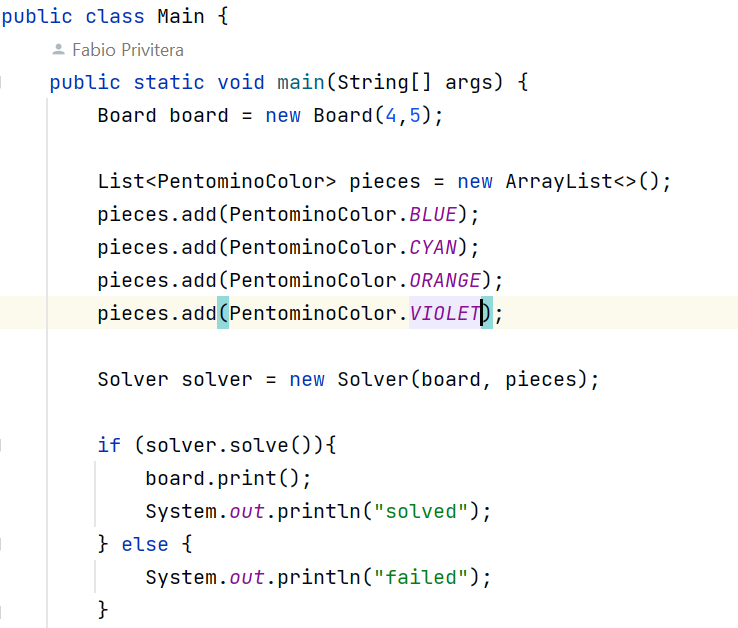
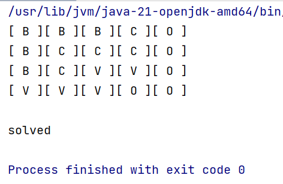
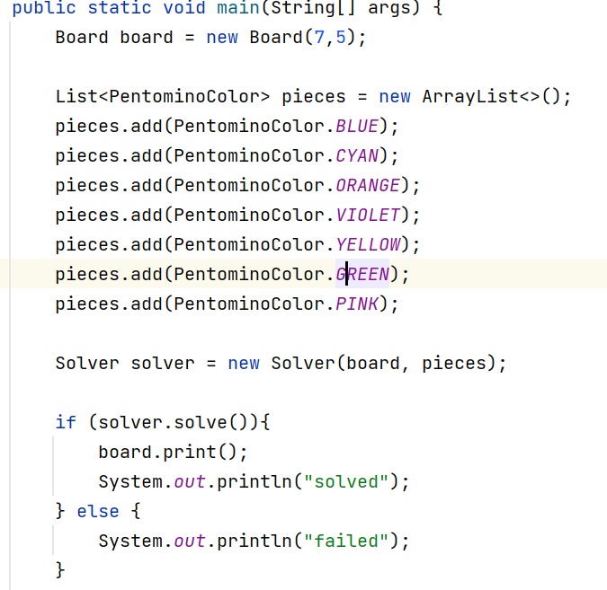
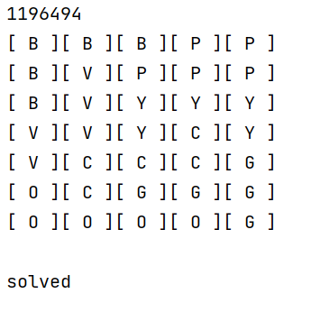
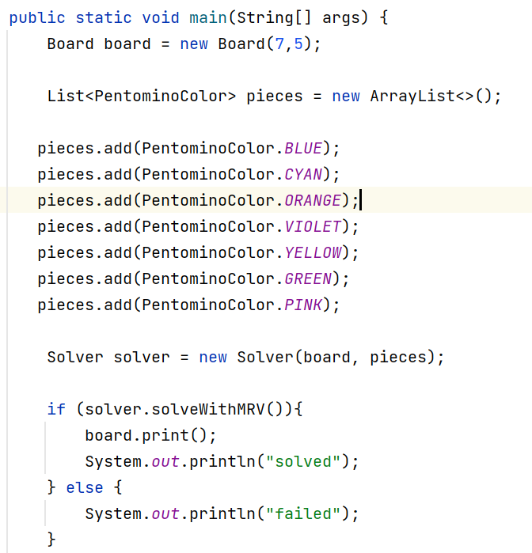
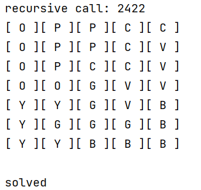
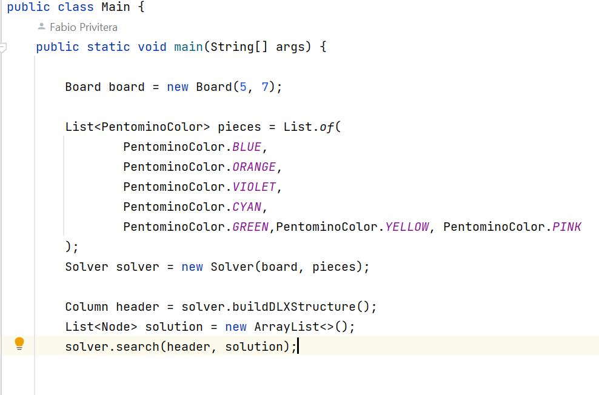
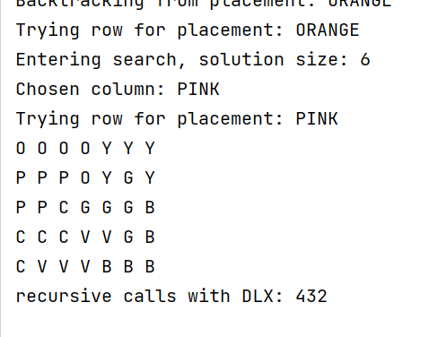

# Katamino Solver

Classic Katamino game, each Pentomino is represented through a 2D boolean array, converted into an list of true coords.
Enabling explorations of possible solutions with backtracking and implicit graph + DFS-like traversal.

## Features
- Board representation and piece placement using a 2D grid
- Predefined Pentomino pieces with colors
- Solver using recursive backtracking
- Print the board in console

------------------
20.1
The solver attempts to place one piece at a time on the board.
For each piece, all possible orientations are stored and normalized.
The algorithm backtracks and tries the next possibility if a placement leads to a dead end.

-----
For a board of 4x5 with four pentaminos the solution is straight forward for the solver to execute (**12 recursive calls on solve()**).
However, there is a huge combinatorics explosion when the board is 7x5 and the number of pieces is 7, and the total number of recursive calls becomes ≃ 1.200.000

It is an exponential grow of time complexity, O(b^d).

22.1
After some **stressful** testing, MRV approach shows benefits.
The overhead introduced for each node is considerable, but the amount of recursive calls when using this "rule of thumb" decreases due to reduced branching.

In a board with 7x5 and 7 Pentomino the solver managed to complete in about 2200 state traversals. 

26.01 -- ***DLX branch***

In this implementation, each cell of the board and each pentomino piece are treated as a column in the exact cover matrix.
Each row represents an option, that is compared amongst all remaining options, and a possible placement of a piece on the board.
This setup allows to explore all valid placements and maintain exact cover constraints (each piece used once, each cell of the board covered exactly once).

The meaning is best explained in Donald Knuth's X algorithm, discovered in 1970.

Given a 5x7 board and 7 pieces that accurately eventually fit on it, the dancing links approach will gain a final fast result (432 recursive calls)
